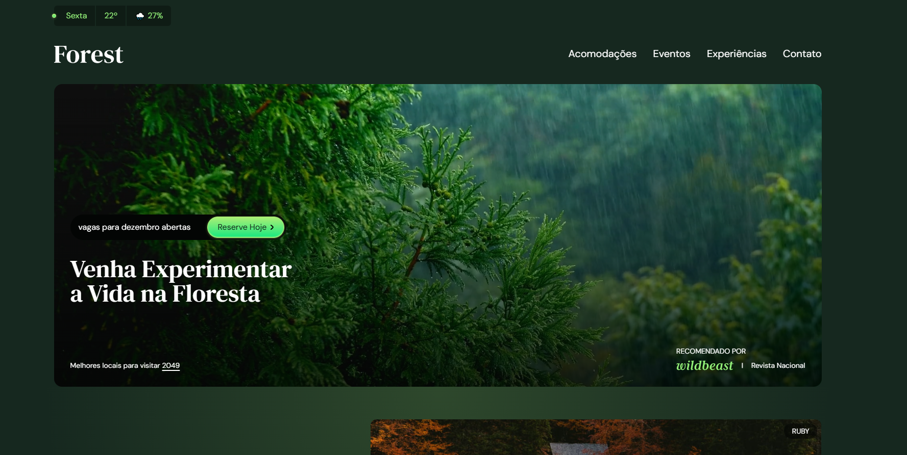

<h1 align="center"> Florest </h1>

Projeto pessoal criado para praticar as técnologias do Tailwind CSS mais a fundo. 

  <a target="_blank" href="https://www.linkedin.com/in/arthur-franco-strelow-869b0b34b/">Linkedin</a>&nbsp;&nbsp;&nbsp;|&nbsp;&nbsp;&nbsp;
  <a target="_blank" href="https://www.instagram.com/arthurstlw/">Instagram</a>

  
  

 

<h2 align="left"> 🚀 Tecnologias </h2>
Esse projeto foi desenvolvido com as seguintes tecnologias:

- HTML e CSS
- Tailwind CSS
- JavaScript
- Git e Github
- Figma

<h2 align="left"> 💻 Projeto </h2>
O Florest é um projeto pessoal criado para explorar a biblioteca do Tailwind CSS, sendo utilizado em todo o site.

---

By Arthur Strelow 👋
